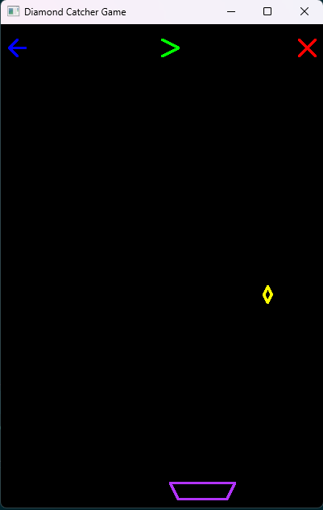

# 🎮 Diamond Catcher Game

> A fun and interactive 2D game developed in **Python** using **PyOpenGL** and **GLUT**, where the player controls a catcher to collect falling diamonds. The game showcases real-time rendering, keyboard and mouse interaction, and line drawing using the Midpoint Line Drawing Algorithm.


## 🖼️ Game Preview




## 📌 Features

* 🎯 **Objective**: Catch the falling diamonds to increase your score.
* ⏬ Diamonds fall with increasing speed over time.
* 🧠 Uses **Midpoint Line Drawing Algorithm** to draw all game elements.
* 🎮 Control the catcher using keyboard arrows.
* 🖱️ Buttons for **Play**, **Back**, and **Exit** using mouse input.
* 🧊 Simple and clean OpenGL rendering with custom shapes.


## 🛠️ Technologies Used

* **Python 3**
* **PyOpenGL**
* **OpenGL.GL**
* **OpenGL.GLUT**
* **OpenGL.GLU**
* Basic computer graphics algorithms (Zone conversion, Midpoint Line)


## 🚀 Getting Started

### ✅ Prerequisites

Ensure you have Python and necessary libraries installed:

```bash
pip install PyOpenGL PyOpenGL_accelerate
```

### 📂 Running the Game

1. Clone the repository:

```bash
git clone https://github.com/yourusername/diamond-catcher.git
cd diamond-catcher
```

2. Run the game:

```bash
python Diamond\ Catcher.py
```

> ℹ️ Ensure your terminal supports GLUT windows (might not work in some headless environments).


## 🎮 Controls

### 🧑‍💻 Keyboard

| Key | Action             |
| --- | ------------------ |
| ←   | Move catcher left  |
| →   | Move catcher right |

### 🖱️ Mouse

| Button Area              | Function                          |
| ------------------------ | --------------------------------- |
| Top-left (Back Button)   | Resets score and diamond position |
| Top-middle (Play Button) | Resumes game                      |
| Top-right (Cross Button) | Exits the game                    |


## 🧩 Code Structure Overview

* `MidPointLine()` – Core line drawing logic using the Midpoint Line Drawing Algorithm.
* `FindZone()`, `ConvertToZoneZero()`, `ConvertToOriginal()` – Used to handle all octants during line drawing.
* `catcher()` – Draws the catcher as a trapezoid using line drawing.
* `diamond()` – Draws falling diamond shape and handles collision detection.
* `display()` – Core rendering loop that updates frame-by-frame.
* `specialKeyboardListener()` – Handles arrow key movement.
* `mouseListener()` – Handles all button click interactions.
* `timer()` – Runs the game at approximately 60 FPS.


## 📊 Game Logic

* A diamond falls from the top at a randomly generated horizontal position.
* The catcher moves horizontally to collect the diamond.
* If caught, score increases and falling speed is incremented.
* If missed, the game stops and final score is printed in the console.


## 📦 Future Improvements (Ideas)

* Add sound effects and background music.
* Add score on the screen
* Implement a main menu with difficulty settings.
* Save high scores between sessions.
* Add more complex shapes using different algorithms.
* Create levels with increasing difficulty.


## 👨‍💻 Author

**Mohammad Jawadul Tashick**


## 🙌 Acknowledgments

* Inspired by classic catch-and-drop games.
* Midpoint Line Algorithm adapted for educational purposes.
* Thanks to the Python & OpenGL community.


